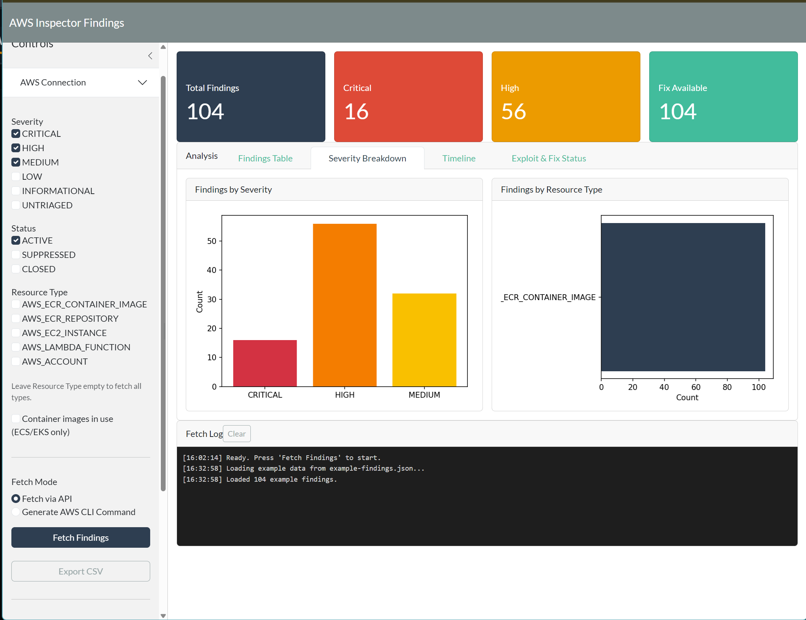

# AWS Inspector Findings

**[🚀 Use the app live on Posit Connect Cloud](https://elliotmurphy-inspector-findings.share.connect.posit.cloud/)**

A Shiny for Python application for fetching, analyzing, and visualizing AWS Inspector security findings.

## Features

- **Fetch findings directly via AWS API** — Use boto3 with your AWS credentials to fetch findings with real-time streaming logs
- **Generate CLI commands** — Generate a cross-platform Python script that uses the AWS CLI to paginate and collect findings
- **Interactive data table** — Sortable, filterable table with per-column search
- **Visualizations** — Severity breakdown, resource type distribution, timeline, and exploit/fix status charts
- **Detailed finding view** — Click any row to see full finding details with links to AWS Console
- **Export to CSV** — Download findings for external analysis

## Quick Start

### Use the Live App

**[👉 Click here to use the app on Posit Connect Cloud](https://elliotmurphy-inspector-findings.share.connect.posit.cloud/)**

No installation required! The live app includes example data you can explore immediately.

### Run Locally

```bash
# Clone the repository
git clone https://github.com/statik/inspector-findings.git
cd inspector-findings

# Create a virtual environment and install dependencies
python -m venv .venv
source .venv/bin/activate  # On Windows: .venv\Scripts\activate
pip install -r requirements.txt

# Run the app
shiny run app.py
```

Open http://localhost:8000 in your browser.

## AWS Credentials

The app supports three credential methods (in order of precedence):

1. **Explicit credentials** — Enter Access Key ID, Secret Access Key, and optional Session Token directly in the app
2. **Named profile** — Use a profile from your `~/.aws/credentials` file
3. **Default credential chain** — Environment variables, EC2 instance profile, or ECS task role

## Filtering

Apply filters before fetching to limit results:

- **Severity** — CRITICAL, HIGH, MEDIUM, LOW, INFORMATIONAL, UNTRIAGED
- **Status** — ACTIVE, SUPPRESSED, CLOSED
- **Resource Type** — Container Image, ECR Repository, EC2 Instance, Lambda Function, Account
- **Container images in use** — Restrict to images actively running in ECS tasks or EKS pods

## CLI Mode

Don't want to provide AWS credentials to the app? Generate a Python script that:

1. Calls the AWS CLI with your filters
2. Handles pagination automatically
3. Outputs a `findings.json` file you can upload to the app

Perfect for running on a bastion host or CI/CD pipeline.

## Architecture

- **Shiny for Python** — Web framework with reactive UI
- **boto3** — AWS SDK for Python
- **pandas** — Data manipulation
- **matplotlib** — Charts and visualizations
- **bslib** — Bootstrap theming (Flatly)

## Screenshots



## Development

This is a single-file Shiny for Python application (~1,080 lines). Key components:

- Async pagination with cancellation support
- Client-side filtering and sorting via DataTable
- Custom JavaScript handlers for clipboard operations
- Sanitization for AWS CLI JSON output with bare control characters

See [AGENTS.md](AGENTS.md) for detailed architecture documentation.

## License

MIT License - see [LICENSE.md](LICENSE.md) for details

## Contributing

Contributions welcome! Please open an issue or submit a pull request.

---

**[🚀 Try it now on Posit Connect Cloud](https://elliotmurphy-inspector-findings.share.connect.posit.cloud/)**
